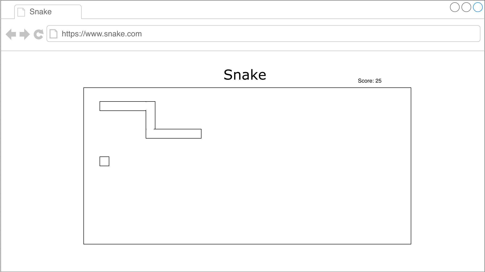

## Snake

### Background

Snake is a classic computer arcade game that allows a human player to maneuver a line in a game board that grows in length and becomes the primary obstacle to progressing.

### Functionality & MVP  

In this version of Snake, a user will be able to:

- [ ] Start a new game
- [ ] See the score of the game
- [ ] Have the speed and difficulty escalate and be sufficiently challenging

In addition, this project will include:

- [ ] A succinct welcome modal describing the rules of the game
- [ ] A production Readme

### Wireframes

This app will consist of a single screen with game board, snake, and food.

### Architecture and Technologies

- Vanilla JavaScript and `jquery` for overall structure and game logic,
- `HTML5 Canvas` for DOM manipulation and rendering,
- Webpack to bundle and serve up the various scripts.

In addition to the webpack entry file, there will be several scripts involved in this project:

* `game` - logic for creating and updating the game

* `snake` - constructor, render and move functions for the snake

* `food` - constructor, render and update functions for the ball

* `player` - logic for the player's actions

### Implementation Timeline

**Day 1**:

Setup all necessary Node modules, including getting webpack up and running.  Create `webpack.config.js` as well as `package.json`.  Write a basic entry file and the bare bones of each script outlined above.  Learn the basics of `Easel.js`.  Goals for the day:

- Get a green bundle with `webpack`
- Learn enough `Easel.js` to render an object to the `Canvas` element
- Write the snake and food classes

**Day 2**:

Write the player and game logic.  Goals for the day:

- Complete the `player` class
- Complete the `game` class

**Day 3**:

Finishing touches and styling.  Goals for the day:

- Make sure gameplay is fun, functional, and sufficiently challenging
- Style the game, including welcome modal and game over modal

### Bonus features

- [ ] Add different speeds based upon the score
- [ ] Add levels
